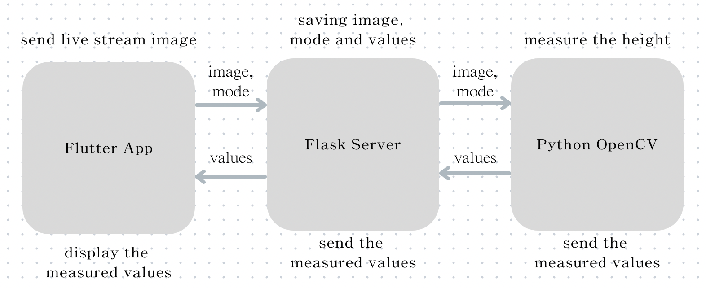

# Smartphone-based Brick Height Measurement Tutorial

## 목적 및 구성
---
본 자료는 단일 2D 카메라 기반 벽돌 좌우 높이 측정 알고리즘 인수인계를 목적으로 한다.

인수인계 자료 구성은 아래와 같다.
- 코드 설계 방식
- 코드 파일 구성 및 실행 방법 주요 코드 설명
- 실행 방법
- 플로우 차트

## 코드 설계 방식
---
플러터 앱 내부에서 파이썬으로 작성된 코드를 돌리는 것이 현실적으로 어려우며 웹 호스팅이나 네이티브 이식과 같은 방식을 고려해보았으나 확장성을 유지하기 위해 핸드폰 카메라에서 실시간으로 사진을 서버에 저장해 불러와 처리 후 돌려보내는 식으로 설계하였습니다.

따라서 벽돌 좌우 높이 측정은 세가지 프로그램으로 이루어집니다.
- Flutter App 
    - Flutter 프레임워크를 사용하여 개발 
    - apk 로 빌드 후 실제 핸드폰에서 사용 
- Flask Server
    - Google Cloud Platform 의 Compute Engine의 Virtual Machine을 활용해 서버 호스팅 
    - python 으로 백엔드 구현이 가능한 flask 프레임워크 사용
- Python OpenCV
    - 파이썬 openCV을 활용해 개발

# Flutter App
Flutter 프레임워크를 사용해 만든 어플리케이션으로 아래와 같은 역할을 수행합니다 : 
- 핸드폰 카메라의 영상을 실시간으로 서버로 전송하는 역할
- 사용자가 직접 모드를 선택하거나 촬영, 종료 버튼 제공

## 코드 파일 구성 (Flutter App)
---
```
    Flutter App/
    |--- lib/
        |--- binding/
            |--- binding.dart            # 사용할 컨트롤러를 bind 하는 역할
        |--- controller/
            |--- cameraController.dart   # 앱 작동에 필요한 여러 정보들의 상태관리
        |--- functions/         
            |--- functions.dart          # 앱 작동에 필요한 여러 함수들
        |--- widgets            
            |--- calibrationPage.dart    # 보정 모드 UI 코드
            |--- HomePage.dart           # 여러 모드들을 관리하며 보여주는 홈 화면 코드
            |--- measurementPage.dart    # 측정 모드 UI 코드
            |--- modelingPage.dart       # 모델링 모드 UI 코드
            |--- resultPage.dart         # 측정 결과 모드 UI 코드
            |--- stackTexts.dart         # 각 모드별 보여지는 텍스트 위젯들
        |--- main.dart                   # 프로그램 실행을 위한 메인 파일
```

## 중요 코드 설명 (Flask Server)
---
```Dart
// 카메라의 사진을 Flask 서버와 Stream 으로 연결하여 전송하며 모드 변경과 측정을 위한 정보들을 받아오는 코드이다.
 _controller.startImageStream((CameraImage image) async {
        // Process the image and send it to the server
        if (CamController.to.mode.value == MODE.CALIBRATION.index ||
            CamController.to.mode.value == MODE.MODELING.index) {
          url = Uri.parse('http://34.71.86.212:5000/get-calib');
          if (CamController.to.mode.value == MODE.MODELING.index)
            url = Uri.parse('http://34.71.86.212:5000/get-modeling');
          var response = await http.get(url);
          if (response.statusCode == 200) {
            setState(() {
              data = json.decode(response.body);
            });
          } else {
            print(
                'Failed to fetch heights. Status code: ${response.statusCode}');
          }
        }
        if (CamController.to.mode.value == 1 ||
            CamController.to.mode.value == 2) {
          url = Uri.parse('http://34.71.86.212:5000/get-mode');
          var response = await http.get(url);
          if (response.statusCode == 200) {
            var t = json.decode(response.body);
            if (t['mode'] == 0) {
              CamController.to.mode.value = MODE.MODE_SELECTION.index;
              setEnd();
            }
          }
        }
        sendImageToServer(image);
      });
```


# Flask Server
호스팅은 GCP의 Virtual Engine으로 하였으며 Flask 프레임워크로 구현했습니다.

Flutter App에서 전송하는 사진, 앱과 알고리즘 사이에서 주고받는 정보들을 저장하며 제공하는 역할을 수행합니다 : 
- 앱에서 전송받은 사진 저장 및 제공
- 현재 mode 정보 저장 및 제공
- 진행사항 관련 정보 저장 및 제공

## 코드 파일 구성 (Flask Server)
---
```python
    Brick Flask/
    |--- brick-flask/
        |--- flaskServer.py              # Flask server 코드 
```

## 중요 코드 설명 (Flask Server)
---
```python
# Flutter App -> Flask Server 사진 전송
@app.route('/upload-stream', methods=['POST'])
def upload_stream():
    global streamed_image

    content_type = request.headers['Content-Type']
    if content_type != 'application/octet-stream':
        return 'Invalid content type', 400

    byte_list = bytearray()
    while True:
        chunk = request.stream.read(1024)
        if not chunk:
            break
        byte_list.extend(chunk)

    img_arr = np.frombuffer(byte_list, dtype=np.uint8)
    img = cv2.imdecode(img_arr, cv2.IMREAD_COLOR)

    streamed_image = img

    return 'Image stream received and processed'

# Flask Server -> OpenCV 사진 전송
@app.route('/get-streamed-image', methods=['GET'])
def get_streamed_image():
    global streamed_image

    if streamed_image is None:
        return 'No streamed image available', 404

    _, img_encoded = cv2.imencode('.jpg', streamed_image)

    file_object = io.BytesIO(img_encoded.tobytes())

    file_object.seek(0)
    file_object.content_type = 'image/jpeg'

    return send_file(file_object, mimetype='image/jpeg', as_attachment=True, download_name="streamed_image.jpg")

# OpenCV -> Flask Server 결과 사진 전송
@app.route('/set-measured-image', methods=['POST'])
def process_image():
    global image_data
    frame_bytes = request.get_data()

    frame_arr = np.frombuffer(frame_bytes, np.uint8)

    frame = cv2.imdecode(frame_arr, cv2.IMREAD_COLOR)
    
    ret, jpeg = cv2.imencode('.jpg', frame)
    frame_bytes = jpeg.tobytes()

    # Convert the frame bytes to Uint8List
    image_data = list(frame_bytes)

    # Return the image data as JSON response
    return jsonify({'imageData': image_data})

# Flask Server -> Flutter App 결과 사진 전송
@app.route('/get-measured-image', methods=['GET'])
def get_measured_image():
    global image_data
    return jsonify({'image_data':image_data})
```

# Python OpenCV
파이썬 openCV 코드이며 아래와 같은 역할을 수행합니다 : 
- flask 서버로부터 사진을 받아와 높이 측정을 위한 보정, 모델링, 측정 단계를 진행
- 측정된 높이의 값을 flask 서버로 전송 

# How to Run
1. Host Flask Server 
    1. Connect to Virtual machine using ssh
    2. move to "/opt/Brick Flask/brick-flask/"
    3. run "python3 flaskServer.py" command
2. Run Flutter App
    1. build apk file by using "flutter build apk --release --target-platform=android-arm64" command
    2. install the apk file
    3. run the app
3. Run the OpenCV code
    1. Run "python3 ObjectHeightEstimation.py"

# Flow Chart
